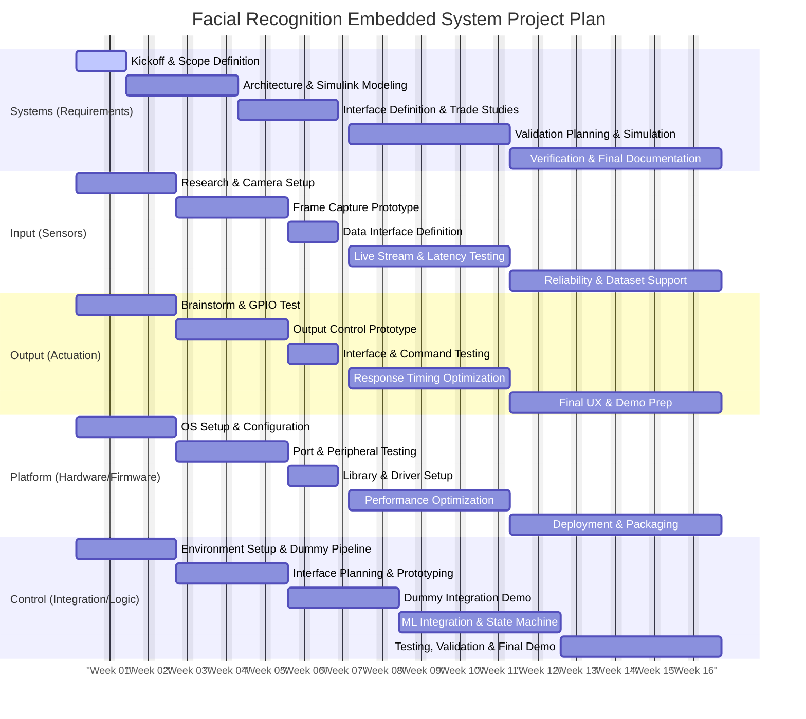

```mermaid
gantt
    title Facial Recognition Embedded System Project Plan
    dateFormat  WW
    axisFormat  "Week %W"
    excludes weekends
    %% Each "section" is a subteam, with tasks running concurrently across 12 weeks

    section Systems (Requirements)
    Kickoff & Scope Definition           :active, sys1, 01, 1w
    Architecture & Simulink Modeling     :sys2, after sys1, 2w
    Interface Definition & Trade Studies :sys3, after sys2, 2w
    Validation Planning & Simulation     :sys4, after sys3, 3w
    Verification & Final Documentation   :sys5, after sys4, 4w

    section Input (Sensors)
    Research & Camera Setup              :inp1, 01, 2w
    Frame Capture Prototype              :inp2, after inp1, 2w
    Data Interface Definition            :inp3, after inp2, 1w
    Live Stream & Latency Testing        :inp4, after inp3, 3w
    Reliability & Dataset Support        :inp5, after inp4, 4w

    section Output (Actuation)
    Brainstorm & GPIO Test               :out1, 01, 2w
    Output Control Prototype             :out2, after out1, 2w
    Interface & Command Testing          :out3, after out2, 1w
    Response Timing Optimization         :out4, after out3, 3w
    Final UX & Demo Prep                 :out5, after out4, 4w

    section Platform (Hardware/Firmware)
    OS Setup & Configuration             :plat1, 01, 2w
    Port & Peripheral Testing            :plat2, after plat1, 2w
    Library & Driver Setup               :plat3, after plat2, 1w
    Performance Optimization             :plat4, after plat3, 3w
    Deployment & Packaging               :plat5, after plat4, 4w

    section Control (Integration/Logic)
    Environment Setup & Dummy Pipeline   :ctrl1, 01, 2w
    Interface Planning & Prototyping     :ctrl2, after ctrl1, 2w
    Dummy Integration Demo               :ctrl3, after ctrl2, 2w
    ML Integration & State Machine       :ctrl4, after ctrl3, 3w
    Testing, Validation & Final Demo     :ctrl5, after ctrl4, 3w
```